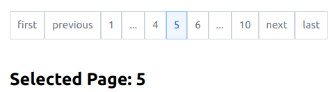

# PaginoDeno

pagination module, typically used for data tables

## History

Ported from React to deno Original project: 

https://github.com/pagino/pagino-js

https://codesandbox.io/s/pagino-13pit

## Example



## Link to deno.land

https://deno.land/x/paginodeno

## Usage

```js
import { Pagino } from "https://deno.land/x/paginodeno/mod.ts";

    function onChange(page: number) {
	    setcurrentPage(page);
    }

    return (
        <>
            <Pagino
                count={10}
                siblingCount={1}
                boundaryCount={1}
                onChange={onChange}
            />
       </>
    );
```

## Features

- optional first, previous, next, last button
- optional number of neighboring items

## Related Projects

DataTable: https://deno.land/x/datatable

PaginoDeno: https://deno.land/x/paginodeno

d3no-chart: https://deno.land/x/d3nochart
